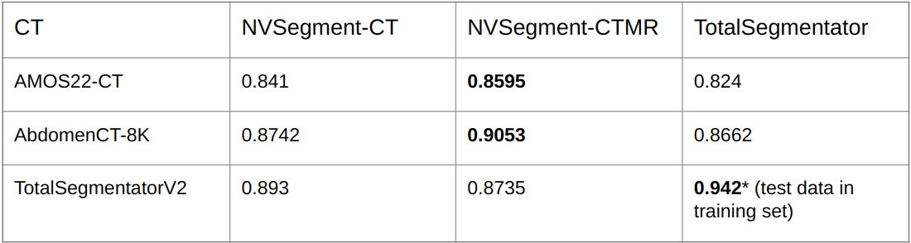
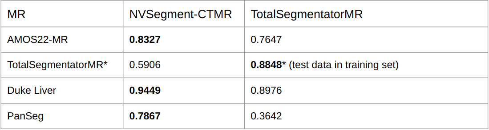

# Model Overview
NV-Segment-CTMR is a unified CT and MRI segmentation foundation model. It is based on VISTA3D CT model and extended to both CT and MRI. Please refer to https://github.com/Project-MONAI/VISTA/tree/main/vista3d for more information.

## Performance on held-out test set
<div align="center">  </div>


### Quick Start
#### Installation
```bash
# use the same conda env as this repo
conda create -y -n vista3d-nv python=3.9
conda activate vista3d-nv
git clone https://github.com/NVIDIA-Medtech/NV-Segment-CTMR.git
cd NV-Segment-CTMR/NV-Segment-CTMR;
pip install -r requirements.txt;
cd ..;
mkdir NV-Segment-CTMR/models
# download from huggingface link
wget -O NV-Segment-CTMR/models/model.pt https://huggingface.co/nvidia/NV-Segment-CTMR/resolve/main/vista3d_pretrained_model/model.pt
```


## Automatic Segmentation (support multi-gpu batch processing)
We defined 345 classes as in [label_dict.json](../configs/label_dict.json). It shows the label organ name, index, training dataset, modality and evaluation dice score. If a class only comes from CT training dataset, it may not perform well on MRI, but the actual performance will vary case by case. We support three type of segment everything "CT_BODY", "MRI_BODY", and "MRI_BRAIN".  "CT_BODY" is the previous VISTA3D bundle supported 132 CT classes. "MRI_BODY" shares the same 50 label class as TotalsegmentatorMR. "MRI_BRAIN" is trained on skull stripped [LUMIR](https://github.com/JHU-MedImage-Reg/LUMIR_L2R) dataset and will segment brain MRI substructures. Preprocessing is needed. Following [tutorials](https://github.com/junyuchen245/MIR/tree/main/tutorials/brain_MRI_preprocessing). The exact mapping for those three everything labels can be found in [metadata.json](../configs/metadata.json)

## Single image inference to segment everything (automatic)
The output will be saved to `output_dir/s0289/s0289_{output_postfix}{output_ext}`. By default the everything will be "CT_BODY". Add "MRI_BODY" to segment the MRI body classes.
```python
# Automatic Segment everything. It requires a modality key. We allow "CT_BODY", "MRI_BODY", and "MRI_BRAIN". For brain, we require preprocessing.
python -m monai.bundle run --config_file configs/inference.json --input_dict "{'image':'example/s0289.nii.gz'}" --modality MRI_BODY
```

## Single image inference to segment specific class (automatic)
The detailed automatic segmentation class index can be found [here](../configs/label_dict.json).
```python
# Automatic Segment specific class
python -m monai.bundle run --config_file configs/inference.json --input_dict "{'image':'example/s0289.nii.gz','label_prompt':[3]}"
```

## Batch inference with multiGPU support for segmenting everything (automatic)
```python
# Segment MRI_BODY within example folder
python -m monai.bundle run --config_file="['configs/inference.json', 'configs/batch_inference.json']" --input_dir="example/" --output_dir="example/" --modality MRI_BODY
```
```python
# Automatic Batch segmentation for the whole folder with multi-gpu support. mgpu_inference.json is below. change nproc_per_node to your GPU number.
torchrun --nproc_per_node=2 --nnodes=1 -m monai.bundle run --config_file="['configs/inference.json', 'configs/batch_inference.json', 'configs/mgpu_inference.json']" --input_dir="example/" --output_dir="example/"
```


`configs/batch_inference.json` by default runs the segment everything workflow (classes defined by `everything_labels`) on all (`*.nii.gz`) files in `input_dir`.
This default is overridable by changing the input folder `input_dir`, or the input image name suffix `input_suffix`, or directly setting the list of filenames `input_list`.

```
Note: if using the finetuned checkpoint and the finetuning label_mapping mapped to global index "2, 20, 21", remove the `subclass` dict from inference.json since those values defined in `subclass` will trigger the wrong subclass segmentation.
```

## Brain MRI segmentation
For brain MRI segmentation, we only support T1 and require preprocessing.
```bash
# Install required preprocessing packages.
cd NV-Segment-CTMR;
conda activate vista3d-nv
git clone https://github.com/junyuchen245/MIR.git
# For MRI brain T1 segmentation, we need preprocessing
cd MIR; pip install -e . --no-deps
pip install antspyx pymedio pydicom SimpleITK
# skull strip docker file
curl -O https://raw.githubusercontent.com/freesurfer/freesurfer/dev/mri_synthstrip/synthstrip-docker && chmod +x synthstrip-docker
cd ..;
```

```bash
# Run preprocessing, segmentation, and revert results back.
input=example/brain_t1.nii.gz # change to your file path
output=example/brain_t1_preprocessed.nii.gz # intermediate results save path
# segmentation results will be saved to ./eval/$output_trans.nii.gz. User can modify saved name in inference.json file.
segmentation_saved=eval/brain_t1_preprocessed/brain_t1_preprocessed_trans.nii.gz
# Skull stripping with SynthStrip. Skip if already skull stripped.
./MIR/synthstrip-docker -i $input -o $output
# Affine align to the LUMIR template
python MIR/tutorials/brain_MRI_preprocessing/preprocess.py $output MIR/tutorials/brain_MRI_preprocessing/LUMIR_template.nii.gz $output --save-preprocess $output.preprocess.json
# Segment the brain
python -m monai.bundle run --config_file configs/inference.json --input_dict "{'image':'$output'}" --modality MRI_BRAIN
# Revert the image back
# Revert a processed mask back to the original space
python MIR/tutorials/brain_MRI_preprocessing/revert_preprocess.py $output --out $output.revert.nii.gz --mask $segmentation_saved --mask-out $segmentation_saved --meta $output.preprocess.json
```

## Execute inference with the TensorRT model:

```
python -m monai.bundle run --config_file "['configs/inference.json', 'configs/inference_trt.json']"
```
For more details, please refer to [this](inference.md).


# Continual learning / Finetuning

## Step1: Generate Data json file
Users need to provide a json data split for continuous learning (`configs/msd_task09_spleen_folds.json` from the [MSD](http://medicaldecathlon.com/) is provided as an example). The data split should meet the following format ('testing' labels are optional):
```json
{
    "training": [
        {"image": "img0001.nii.gz", "label": "label0001.nii.gz", "fold": 0},
        {"image": "img0002.nii.gz", "label": "label0002.nii.gz", "fold": 2},
        ...
     ],
    "testing": [
        {"image": "img0003.nii.gz", "label": "label0003.nii.gz"},
        {"image": "img0004.nii.gz", "label": "label0004.nii.gz"},
        ...
   ]
}
```
Example code for 5 fold cross-validation generation can be found [here](data.md)
```
Note the data is not the absolute path to the image and label file. The actual image file will be `os.path.join(dataset_dir, data["training"][item]["image"])`, where `dataset_dir` is defined in `configs/train_continual.json`. Also 5-fold cross-validation is not required! `fold=0` is defined in train.json, which means any data item with fold==0 will be used as validation and other fold will be used for training. So if you only have train/val split, you can manually set validation data with "fold": 0 in its datalist and the other to be training by setting "fold" to any number other than 0.
```
## Step2: Changing hyperparameters
For continual learning, user can change `configs/train_continual.json`. More advanced users can change configurations in `configs/train.json`.  Most hyperparameters are straighforward and user can tell based on their names. The users must manually change the following keys in `configs/train_continual.json`.
#### 1. `label_mappings`
```
    "label_mappings": {
        "default": [
            [
                index_1_in_user_data, # e.g. 1
                mapped_index_1, # e.g. 1
            ],
            [
                index_2_in_user_data, # e.g. 2
                mapped_index_2, # e.g. 2
            ], ...,
            [
                index_last_in_user_data, # e.g. N
                mapped_index_N, # e.g. N
            ]
        ]
    },
```
`index_1_in_user_data`,...,`index_N_in_user_data` is the class index value in the groundtruth that user tries to segment. `mapped_index_1`,...,`mapped_index_N` is the mapped index value that the bundle will output. You can make these two the same for finetuning, but we suggest finding the semantic relevant mappings from our unified [global label index](../configs/metadata.json). For example, "Spleen" in MSD09 groundtruth label is represented by 1, but "Spleen" is 3 in `docs/labels.json`. So by defining label mapping `[[1, 3]]`, VISTA3D can segment "Spleen" using its pretrained weights out-of-the-box, and can speed up the finetuning convergence speed. If you cannot find a relevant semantic label for your class, just use any value < `num_classes` defined in train_continue.json. For more details about this label_mapping, please read [this](finetune.md).

#### 2.  `data_list_file_path` and `dataset_dir`
Change `data_list_file_path` to the absolute path of your data json split. Change `dataset_dir` to the root folder that combines with the relative path in the data json split.

#### 3. Optional hyperparameters and details are [here](finetune.md).
Hyperparameteers finetuning is important and varies from task to task.

## Step3: Run finetuning
The hyperparameters in `configs/train_continual.json` will overwrite ones in `configs/train.json`. Configs in the back will overide the previous ones if they have the same key.

Single-GPU:
```bash
python -m monai.bundle run \
	--config_file="['configs/train.json','configs/train_continual.json']"
```

Multi-GPU:
```bash
torchrun --nnodes=1 --nproc_per_node=8 -m monai.bundle run \
	--config_file="['configs/train.json','configs/train_continual.json','configs/multi_gpu_train.json']"
```

#### MLFlow Visualization

MLFlow is enabled by default (defined in train.json, use_mlflow) and the data is stored in the `mlruns/` folder under the bundle's root directory. To launch the MLflow UI and track your experiment data, follow these steps:

1. Open a terminal and navigate to the root directory of your bundle where the `mlruns/` folder is located.

2. Execute the following command to start the MLflow server. This will make the MLflow UI accessible.

```Bash
mlflow ui
```

# Evaluation
Evaluation can be used to calculate dice scores for the model or a finetuned model. Change the `ckpt_path` to the checkpoint you wish to evaluate. The dice score is calculated on the original image spacing using `invertd`, while the dice score during finetuning is calculated on resampled space.

```
NOTE: Evaluation does not support point evaluation.`"validate#evaluator#hyper_kwargs#val_head` is always set to `auto`.
```

Single-GPU:
```
python -m monai.bundle run \
	--config_file="['configs/train.json','configs/train_continual.json','configs/evaluate.json']"
```

Multi-GPU:
```
torchrun --nnodes=1 --nproc_per_node=8 -m monai.bundle run \
	--config_file="['configs/train.json','configs/train_continual.json','configs/evaluate.json','configs/mgpu_evaluate.json']"
```
#### Other explanatory items
The `label_mapping` in `evaluation.json` does not include `0` because the postprocessing step performs argmax (`VistaPostTransformd`), and a `0` prediction would negatively impact performance. In continuous learning, however, `0` is included for validation because no argmax is performed, and validation is done channel-wise (include_background=False). Additionally, `Relabeld` in `postprocessing` is required to map `label` and `pred` back to sequential indexes like `0, 1, 2, 3, 4` for dice calculation, as they are not in one-hot format. Evaluation does not support `point`, but finetuning does, as it does not perform argmax.


# FAQ
## TroubleShoot for Out-of-Memory
- Changing `patch_size` to a smaller value such as `"patch_size": [96, 96, 96]` would reduce the training/inference memory footprint.
- Changing `train_dataset_cache_rate` and `val_dataset_cache_rate` to a smaller value like `0.1` can solve the out-of-cpu memory issue when using huge finetuning dataset.
- Set `"postprocessing#transforms#0#_disabled_": false` to move the postprocessing to cpu to reduce the GPU memory footprint.

## Multi-channel input
- Change `input_channels` in `train.json` to your desired channel number
- Data split json can be a single multi-channel image or can be a list of single channeled images. Those images must have the same spatial shape and aligned/registered.
```
        {
            "image": ["modality1.nii.gz", "modality2.nii.gz", "modality3.nii.gz"]
            "label": "label.nii.gz"
        },
```
## Wrong inference results from finetuned checkpoint
- Make sure you removed the `subclass` dictionary from inference.json if you ever mapped local index to [2,20,21]
- Make sure `0` is not included in your inference prompt for automatic segmentation.


# References
- Antonelli, M., Reinke, A., Bakas, S. et al. The Medical Segmentation Decathlon. Nat Commun 13, 4128 (2022). https://doi.org/10.1038/s41467-022-30695-9

- VISTA3D: Versatile Imaging SegmenTation and Annotation model for 3D Computed Tomography. arxiv (2024) https://arxiv.org/abs/2406.05285


# License

## Code License

This project includes code licensed under the Apache License 2.0.
You may obtain a copy of the License at

   http://www.apache.org/licenses/LICENSE-2.0

## Model Weights License

The model weights included in this project are licensed under the NCLS v1 License.

Both licenses' full texts have been combined into a single `LICENSE` file. Please refer to this `LICENSE` file for more details about the terms and conditions of both licenses.

For MRI CT joint model. The license is non-commercial and needs furture discussion. 